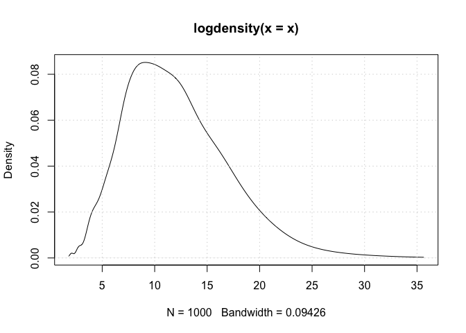
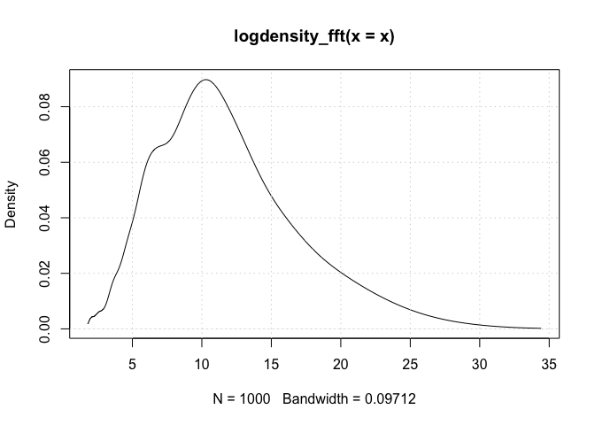

<!-- README.md is generated from README.Rmd. Please edit that file -->

# logKDE

</img></a>
[](https://CRAN.R-project.org/package=logKDE)

The goal of logKDE is to efficiently compute Kernel Density Estimates in
Log Domain with a wide variety of kernels. In addition it provides two
new BW estimators for use with strictly positive densities.

## Installation

You can install the latest stable build of logKDE from CRAN using the
command below:

``` r
install.packages("logKDE", repos='http://cran.us.r-project.org')
```

## Example

This is a very basic example:

``` r
## load library
library(logKDE)

## strictly positive data
x<-rchisq(1000,12)

## do KDE
y<-logdensity(x)

## what if we want it faster
y_fft<-logdensity_fft(x)

## Plot the two KDEs
plot(y)
grid()
```

<!-- -->

``` r
plot(y_fft)
grid()
```

<!-- -->
