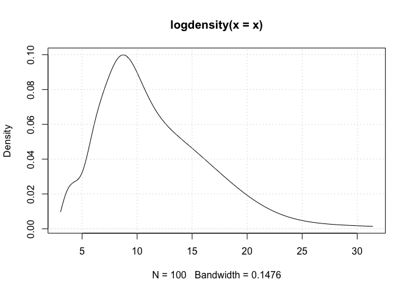
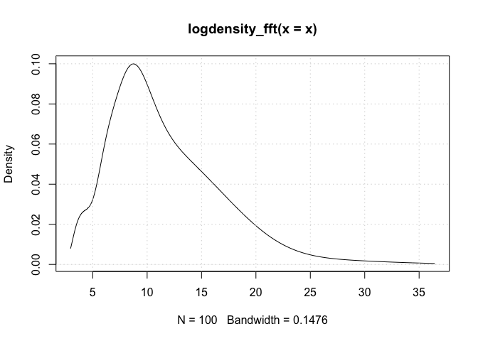

<!-- README.md is generated from README.Rmd. Please edit that file -->

# logKDE: log-transformed kernel density estimation

</img></a>
[](https://CRAN.R-project.org/package=logKDE)
[](https://doi.org/10.5281/zenodo.1317784)

The goal of logKDE is to provide a set of functions for kernel density
estimation on the positive domain, using log-kernel density functions.
The main functions of the package are the `logdensity` and
`logdensity_fft` functions. The choice of functional syntax was made to
resemble those of the `density` function, for conducting kernel density
estimation on the real domain. The `logdensity` function conducts
density estimation, via first principle computations, whereas
`logdensity_fft` utilizes fast-Fourier transformation in order to speed
up computation. The use of Rcpp guarantees that both methods are
sufficiently fast for large data scenarios.

Currently, a variety of kernel functions and plugin bandwidth methods
are available. By default both `logdensity` and `logdensity_fft` are set
to use log-normal kernel functions (`kernel = 'gaussian'`) and
Silverman’s rule-of-thumb bandwidth, applied to log-transformed data
(`bw = 'nrd0'`). However, the following kernels are also available:

  - log-Epanechnikov (`kernel = 'epanechnikov'`),
  - log-Laplace (`kernel = 'laplace'`),
  - log-logistic (`kernel = 'logistic'`),
  - log-triangular (`kernel = 'triangular'`),
  - log-uniform (`kernel = 'uniform'`).

The following plugin bandwidth methods are also available:

  - all of the methods that available for density, applied to
    log-transformed data (see `?bw.nrd` regarding the options),
  - unbiased cross-validated bandwidths in the positive domain (`bw =
    'bw.logCV'`),
  - a Silverman-type rule-of-thumb that optimizes the kernel density
    estimator fit, compared to a log-normal density function (`bw =
    'bw.logG'`).

For a comprehensive review of the literature on positive-domain kernel
density estimation, thorough descriptions of the mathematics relating to
the methods that have been described, simulation results, and example
applications of the `logKDE` package, please consult the package
vignette. The vignette is available via the command
`vignette('logKDE')`, once the package is installed.

## Installation

If `devtools` has already been installed, then the most current build of
`logKDE` can be obtained via the command:

``` r
devtools::install_github('andrewthomasjones/logKDE')
```

The latest stable build of `logKDE` can be obtain from CRAN via the
command:

``` r
install.packages("logKDE", repos='http://cran.us.r-project.org')
```

An archival build of `logKDE` is available at
<https://zenodo.org/record/1317784>. Manual installation instructions
can be found within the R installation and administration manual
<https://cran.r-project.org/doc/manuals/r-release/R-admin.html>.

## Example

This is a very basic example:

``` r
## load library
library(logKDE)

## strictly positive data
x<-rchisq(100,12)

## do KDE
y<-logdensity(x)

## what if we want it faster
y_fft<-logdensity_fft(x)

## Plot the two KDEs
plot(y)
grid()
```

<!-- -->

``` r
plot(y_fft)
grid()
```

<!-- -->
