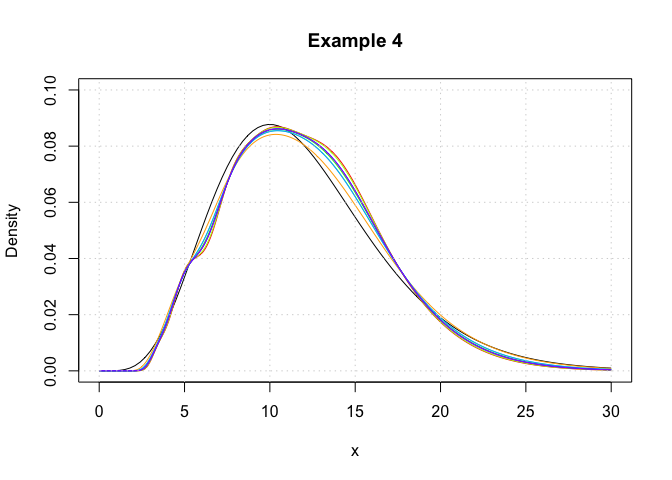

<!-- README.md is generated from README.Rmd. Please edit that file -->

# logKDE: log-transformed kernel density estimation

</img></a>
[](https://CRAN.R-project.org/package=logKDE)
[](https://doi.org/10.5281/zenodo.1339352)
[](https://doi.org/10.21105/joss.00870)
[](https://travis-ci.org/andrewthomasjones/logKDE)

The goal of logKDE is to provide a set of functions for kernel density
estimation on the positive domain, using log-kernel density functions,
for the *R* programming environment. The main functions of the package
are the `logdensity` and `logdensity_fft` functions. The choice of
functional syntax was made to resemble those of the `density` function,
for conducting kernel density estimation on the real domain. The
`logdensity` function conducts density estimation, via first principle
computations, whereas `logdensity_fft` utilizes fast-Fourier
transformation in order to speed up computation. The use of `Rcpp`
guarantees that both methods are sufficiently fast for large data
scenarios.

Currently, a variety of kernel functions and plugin bandwidth methods
are available. By default both `logdensity` and `logdensity_fft` are set
to use log-normal kernel functions (`kernel = 'gaussian'`) and
Silverman’s rule-of-thumb bandwidth, applied to log-transformed data
(`bw = 'nrd0'`). However, the following kernels are also available:

  - log-Epanechnikov (`kernel = 'epanechnikov'`),
  - log-Laplace (`kernel = 'laplace'`),
  - log-logistic (`kernel = 'logistic'`),
  - log-triangular (`kernel = 'triangular'`),
  - log-uniform (`kernel = 'uniform'`).

The following plugin bandwidth methods are also available:

  - all of the methods that available for density, applied to
    log-transformed data (see `?bw.nrd` regarding the options),
  - unbiased cross-validated bandwidths in the positive domain (`bw =
    'logcv'`),
  - a Silverman-type rule-of-thumb that optimizes the kernel density
    estimator fit, compared to a log-normal density function (`bw =
    'logg'`).

The `logdensity` and `logdensity_fft` functions also behave in the same
way as `density`, when called within the `plot` function. The usual
assortment of commands that apply to `plot` output objects can also be
called.

For a comprehensive review of the literature on positive-domain kernel
density estimation, thorough descriptions of the mathematics relating to
the methods that have been described, simulation results, and example
applications of the `logKDE` package, please consult the package
vignette. The vignette is available via the command
`vignette('logKDE')`, once the package is installed.

## Installation

If `devtools` has already been installed, then the most current build of
`logKDE` can be obtained via the command:

``` r
devtools::install_github('andrewthomasjones/logKDE',build_vignettes = T)
```

The latest stable build of `logKDE` can be obtain from CRAN via the
command:

``` r
install.packages("logKDE", repos='http://cran.us.r-project.org')
```

An archival build of `logKDE` is available at
<https://zenodo.org/record/1317784>. Manual installation instructions
can be found within the *R* installation and administration manual
<https://cran.r-project.org/doc/manuals/r-release/R-admin.html>.

## Examples

### Example 1

In this example, we demonstrate that `logdensity` has nearly identical
syntax to `density`. We also show that the format of the outputs are
also nearly identical.

``` r
## Load 'logKDE' library.
library(logKDE)

## Set a random seed.
set.seed(1)

## Generate strictly positive data.
## Data are generated from a chi-squared distribution with 12 degrees of freedom.
x <- rchisq(100,6)

## Construct and print the output of the function 'density'.
density(x)
#> 
#> Call:
#>  density.default(x = x)
#> 
#> Data: x (100 obs.);  Bandwidth 'bw' = 1.018
#> 
#>        x                y            
#>  Min.   :-2.366   Min.   :0.0000475  
#>  1st Qu.: 2.547   1st Qu.:0.0072263  
#>  Median : 7.459   Median :0.0331904  
#>  Mean   : 7.459   Mean   :0.0508396  
#>  3rd Qu.:12.372   3rd Qu.:0.1013289  
#>  Max.   :17.284   Max.   :0.1312107

## Construct and print the output of the function 'logdensity'.
logdensity(x)
#> 
#> Call:
#>  logdensity(x = x)
#> 
#> Data: x (100 obs.);  Bandwidth 'bw' = 0.1923
#> 
#>        x                 y          
#>  Min.   : 0.1111   Min.   :0.00000  
#>  1st Qu.: 3.7851   1st Qu.:0.02313  
#>  Median : 7.4592   Median :0.06527  
#>  Mean   : 7.4592   Mean   :0.06707  
#>  3rd Qu.:11.1333   3rd Qu.:0.11219  
#>  Max.   :14.8073   Max.   :0.13698

## Plot the 'density' output object.
plot(density(x))
```

<!-- -->

``` r

## Plot the 'logdensity' output object.
plot(logdensity(x))
```

<!-- -->

As a note, one can observe that `density` assigns positive probability
to negative values. Since we know that the chi-squared generative model
generates only positive values, this is an undesirable result. The
log-transformed kernel density estimator that is produced by
`logdensity` only assigns positive probability to positive values, and
is thus bona fide in this estimation scenario.

-----

### Example 2

In this example, we showcase the variety of kernel functions that are
available in the package. Here, log-transformed kernel density
estimators are constructed using the `logdensity` function.

``` r
## Load 'logKDE' library.
library(logKDE)

## Set a random seed.
set.seed(1)

## Generate strictly positive data.
## Data are generated from a chi-squared distribution with 12 degrees of freedom.
x <- rchisq(100,12)

## Construct a log-KDE using the data, and using each of the available kernel functions.
logKDE1 <- logdensity(x,kernel = 'gaussian',from = 1e-6,to = 30)
logKDE2 <- logdensity(x,kernel = 'epanechnikov',from = 1e-6,to = 30)
logKDE3 <- logdensity(x,kernel = 'laplace',from = 1e-6,to = 30)
logKDE4 <- logdensity(x,kernel = 'logistic',from = 1e-6,to = 30)
logKDE5 <- logdensity(x,kernel = 'triangular',from = 1e-6,to = 30)
logKDE6 <- logdensity(x,kernel = 'uniform',from = 1e-6,to = 30)

## Plot the true probability density function of the generative model.
plot(c(0,30),c(0,0.1),type='n',xlab='x',ylab='Density',main='Example 2')
curve(dchisq(x,12),from = 0,to = 30,add = T)

## Plot each of the log-KDE functions, each in a different rainbow() colour.
lines(logKDE1$x,logKDE1$y,col = rainbow(7)[1])
lines(logKDE2$x,logKDE2$y,col = rainbow(7)[2])
lines(logKDE3$x,logKDE3$y,col = rainbow(7)[3])
lines(logKDE4$x,logKDE4$y,col = rainbow(7)[4])
lines(logKDE5$x,logKDE5$y,col = rainbow(7)[5])
lines(logKDE6$x,logKDE6$y,col = rainbow(7)[6])

## Add a grid for a visual guide.
grid()
```

<!-- -->

-----

### Example 3

In this example, we show that `logdensity` and `logdensity_ftt` yield
nearly identical results. Here, log-transformed kernel density
estimators are constructed using the `logdensity_ftt` function.

``` r
## Load 'logKDE' library.
library(logKDE)

## Set a random seed.
set.seed(1)

## Generate strictly positive data.
## Data are generated from a chi-squared distribution with 12 degrees of freedom.
x <- rchisq(100,12)

## Construct a log-KDE using the data, and using each of the available kernel functions.
logKDE1 <- logdensity_fft(x,kernel = 'gaussian',from = 1e-6,to = 30)
logKDE2 <- logdensity_fft(x,kernel = 'epanechnikov',from = 1e-6,to = 30)
logKDE3 <- logdensity_fft(x,kernel = 'laplace',from = 1e-6,to = 30)
logKDE4 <- logdensity_fft(x,kernel = 'logistic',from = 1e-6,to = 30)
logKDE5 <- logdensity_fft(x,kernel = 'triangular',from = 1e-6,to = 30)
logKDE6 <- logdensity_fft(x,kernel = 'uniform',from = 1e-6,to = 30)

## Plot the true probability density function of the generative model.
plot(c(0,30),c(0,0.1),type='n',xlab='x',ylab='Density',main='Example 3')
curve(dchisq(x,12),from = 0,to = 30,add = T)

## Plot each of the log-KDE functions, each in a different rainbow() colour.
lines(logKDE1$x,logKDE1$y,col = rainbow(7)[1])
lines(logKDE2$x,logKDE2$y,col = rainbow(7)[2])
lines(logKDE3$x,logKDE3$y,col = rainbow(7)[3])
lines(logKDE4$x,logKDE4$y,col = rainbow(7)[4])
lines(logKDE5$x,logKDE5$y,col = rainbow(7)[5])
lines(logKDE6$x,logKDE6$y,col = rainbow(7)[6])

## Add a grid for a visual guide.
grid()
```

<!-- -->

We observe that the `logdensity_fft` outputs are noticiably smoother
than those of `logdensity`. This is because fast Fourier transformations
(FFT) only yield kernel density estimates at discrete points, and the
regions between these discrete points are approximated via a linear
approximator, namely using the `approx` function. This is the same
evaluation technique as that which is used in the function `density`.
Additionally the FFT approximation points are evenly space on the real
line, whereas those used for `logdensity` are evenly spaced on a log
scale.

-----

### Example 4

In this example, we showcase the variety of plugin bandwidth estimators
that are available in the package. Here, log-transformed kernel density
estimators are constructed using the `logdensity` function.

``` r
## Load 'logKDE' library.
library(logKDE)

## Set a random seed.
set.seed(1)

## Generate strictly positive data.
## Data are generated from a chi-squared distribution with 12 degrees of freedom.
x <- rchisq(100,12)

## Construct a log-KDE using the data, and using each of the available kernel functions.
logKDE1 <- logdensity(x,bw = 'nrd0',from = 1e-6,to = 30)
logKDE2 <- logdensity(x,bw = 'logcv',from = 1e-6,to = 30)
logKDE3 <- logdensity(x,bw = 'logg',from = 1e-6,to = 30)
logKDE4 <- logdensity(x,bw = 'nrd',from = 1e-6,to = 30)
logKDE5 <- logdensity(x,bw = 'ucv',from = 1e-6,to = 30)
#> Warning in stats::bw.ucv(log(x)): minimum occurred at one end of the range
logKDE6 <- logdensity(x,bw = 'bcv',from = 1e-6,to = 30)
#> Warning in stats::bw.bcv(log(x)): minimum occurred at one end of the range
logKDE7 <- logdensity(x,bw = 'SJ-ste',from = 1e-6,to = 30)
logKDE8 <- logdensity(x,bw = 'SJ-dpi',from = 1e-6,to = 30)


## Plot the true probability density function of the generative model.
plot(c(0,30),c(0,0.1),type='n',xlab='x',ylab='Density',main='Example 4')
curve(dchisq(x,12),from = 0,to = 30,add = T)

## Plot each of the log-KDE functions with different choices of bandwidth, each in a different rainbow() colour.
lines(logKDE1$x,logKDE1$y,col = rainbow(9)[1])
lines(logKDE2$x,logKDE2$y,col = rainbow(9)[2])
lines(logKDE3$x,logKDE3$y,col = rainbow(9)[3])
lines(logKDE4$x,logKDE4$y,col = rainbow(9)[4])
lines(logKDE5$x,logKDE5$y,col = rainbow(9)[5])
lines(logKDE6$x,logKDE6$y,col = rainbow(9)[6])
lines(logKDE7$x,logKDE7$y,col = rainbow(9)[7])
lines(logKDE8$x,logKDE8$y,col = rainbow(9)[8])

## Add a grid for a visual guide.
grid()
```

<!-- -->

## Unit testing

Using the package `testthat`, we have conducted the following unit test
for the GitHub build, on the date: 06 August, 2018. The testing files
are contained in the
[tests](https://github.com/andrewthomasjones/logKDE/tree/master/tests)
folder of the respository.

``` r


## Load 'logKDE' library.
library(logKDE)

## Load 'testthat' library.
library(testthat)

## Test 'logKDE'.
test_package('logKDE')
#> ══ testthat results  ════════════════════════════════════════════════════════════════════════════════════════════════════
#> OK: 74 SKIPPED: 0 FAILED: 0
```

## Bug reporting and contributions

Thank you for your interest in `logKDE`. If you happen to find any bugs
in the program, then please report them on the Issues page
(<https://github.com/andrewthomasjones/logKDE/issues>). Support can also
be sought on this page. Furthermore, if you would like to make a
contribution to the software, then please forward a pull request to the
owner of the repository.
